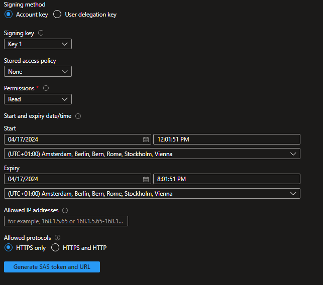

# Talking Avatar with your Custom Avatar

## Requirements
The following requirements are needed:

- An Azure subscription

### Tools
- Azure CLI
    - Please refer to the [install guide](https://docs.microsoft.com/cli/azure/install-azure-cli) for detailed install instructions.

- Terraform
    - [Download](https://developer.hashicorp.com/terraform/downloads?product_intent=terraform)
    - Please refer to the [install cli](https://developer.hashicorp.com/terraform/tutorials/azure-get-started/install-cli) for detailed install instruction.

[[RDS: is this [Install Terraform on Windows with Azure Powershell](https://learn.microsoft.com/en-us/azure/developer/terraform/get-started-windows-powershell?tabs=bash) not easier? This article also includes how to Authenticate via a Microsoft account and set the target subscription (i.e., the one Damian created).

Alternative: set the subscription_id in the terraform providers.tf already.
]]


- Visual Studio Code Extension "Terraform"
    - https://marketplace.visualstudio.com/items?itemName=HashiCorp.terraform

- Terraform specific [[RDS: these will be automatically downloaded when running terraform init -upgrade. No real need to list them here?]]
    - <a name="requirement_terraform"></a> [terraform](#requirement\_terraform) (>= 1.6.0)
    - <a name="requirement_azapi"></a> [azapi](#requirement\_azapi) (>= 1.10.0)
    - <a name="requirement_azurerm"></a> [azurerm](#requirement\_azurerm) (>= 3.79.0)
    - <a name="requirement_random"></a> [random](#requirement\_random) (>= 3.1.0)
    - <a name="requirement_time"></a> [time](#requirement\_time) (>= 0.9.1)


## Preparation - Backend

1. Clone this repository

2. Create the following Azure resources with Terraform:
    
   - Azure SQL with the following settings
     - Authentication: SQL and Microsoft Entra authentication enabled
     - Networking: Allow Azure services and resources to access this server enabled
   - Azure Blob Storage account

[[RDS: 
I've removed the DB creation, but kept the SQL Server as the DB is dropped and created in the python script.

This solves also the strange error when attempting to apply the Azure SQL Db in the terraform:
SQL Server was created, but during the DB, I got this.
`` Error: reading SQL Server Blob Connection Policy Server (Subscription: "9d894bc7-836c-4caf-bea5-f570170528d1"
│ Resource Group Name: "hack-rg-golden-buffalo"
│ Server Name: "sql-awake-hedgehog"): unexpected status 404 (404 Not Found) with error: ParentResourceNotFound: Failed to perform 'read' on resource(s) of type 'servers/connectionPolicies', because the parent resource '/subscriptions/9d894bc7-836c-4caf-bea5-f570170528d1/resourceGroups/hack-rg-golden-buffalo/providers/Microsoft.Sql/servers/sql-awake-hedgehog' could not be found.``
]]

3. Generate a **SAS URL** for the blob storage container. Set the expiry date according to the planned lifecycle of your application.

    

4. Run the cells in the `create-database.ipynb` notebook to create the Azure SQL Database.


## Terraform CLI
### Overview
Terraform expects to be invoked from a working directory that contains configuration files written in the Terraform language. Terraform uses configuration content from this directory, and also uses the directory to store settings, cached plugins and modules, and sometimes state data.

A working directory must be initialized before Terraform can perform any operations in it (like provisioning infrastructure or modifying state).

### Working directory
A Terraform working directory typically contains:
- A Terraform configuration describing resources Terraform should manage. This configuration is expected to change over time.
- A hidden <b>.terraform</b> directory, which Terraform uses to manage cached provider plugins and modules, record which <b>workspace</b> is currently active, and record the last known backend configuration in case it needs to migrate state on the next run. This directory is automatically managed by Terraform, and is created during initialization.
- State data, if the configuration uses the default <b>local</b> backend. This is managed by Terraform in a <b>terraform.tfstate</b> file (if the directory only uses the default workspace) or a <b>terraform.tfstate.d</b> directory (if the directory uses multiple workspaces).


## Modules
### Modules structure
All modules have the same structure:
The modules are designed so that they can be executed separately and are independent of each other.

## Variables
All required variables are already specified. However, these can be customized accordingly.

### i.e. - location
Description: Must be specified, e.g. ```East US```. 
Defines the Azure region in which region bound resources are to be deployed.


## Initialize Terraform
Run <b>terraform init</b> to initialize a working directory that contains a Terraform configuration. This command downloads the Azure provider required to manage the Azure resources. The <b>-upgrade</b> parameter upgrades the necessary provider plugins to the newest version that complies with the configurations version constraints.
```
terraform init -upgrade
```

### Create a Terraform execution plan
Run <b>terraform plan</b> to create an execution plan. 
```
terraform plan
```


### Apply a Terraform execution plan
Run <b>terraform apply</b> to apply the execution plan.
```
terraform apply
```

### Get the output values
Run <b>terraform output</b> after applying the execution plan.
```
terraform output -json
```